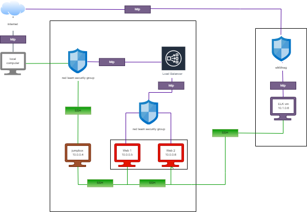

# ELK Stack Project

Creating an ELK Stack to monitor azure VMs

## Automated ELK Stack Deployment

The files in this repository were used to configure the network depicted below.

 

These files have been tested and used to generate a live ELK deployment on Azure. They can be used to either recreate the entire deployment pictured above. Alternatively, select portions of the _____ file may be used to install only certain pieces of it, such as Filebeat.

  -

This document contains the following details:
- Description of the Topologu
- Access Policies
- ELK Configuration
  - Beats in Use
  - Machines Being Monitored
- How to Use the Ansible Build

### Description of the Topology

The main purpose of this network is to expose a load-balanced and monitored instance of DVWA, the D*mn Vulnerable Web Application.

Load balancing ensures that the application will be highly available for customers, in addition to restricting attacks to the network. If a server goes down, or needs to be updated, services will still continue. -The advantage of using a jump box is that only the jump box can access the Virutal network via ssh.

Integrating an ELK server allows users to easily monitor the vulnerable VMs for changes to the logs and system traffic.
- Filebeat monitors the log files or locations specified, collects log events, and forwards them either to Elasticsearch or Logstash for indexing.
- Metricbeat is an extremely easy-to-use, efficient and reliable metric shipper for monitoring your system and the processes running on it. The configuration details of each machine may be found below.

| Name       | Function   | IP Adress | Operating Sysrem |
|------------|------------|-----------|------------------|
| Jumpbox    | Gateway    | 10.0.04   | Linux            |
| Web 1      | Server     | 10.0.0.5  | Linux            |
| Web 2      | Server     | 10.0.0.6  | Linux            |
| Elk server | Monitoring | 10.1.0.6  | Linux            |

### Access Policies

The machines on the internal network are not exposed to the public Internet. 

Only the Jumpbox machine can accept connections from the Internet. Access to this machine is only allowed from My work stations IP adress.

Machines within the network can only be accessed by SSH.
- The only machine that is able to connect to ELK VM is Jump Box from private IP Address 10.0.0.4

A summary of the access policies in place can be found in the table below.

| Name    | Publicly Accessible | Allowed IP Adress |
|---------|---------------------|-------------------|
| Jumpbox | Yes                 | 10.0.0.4          |
| Web 1   | No                  | 10.0.0.5          |
| Web 2   | No                  | 10.0.0.6          |
| Elk-VM  | No                  | 10.1.0.6          |

### Elk Configuration

Ansible was used to automate configuration of the ELK machine. No configuration was performed manually, which is advantageous because...
- This allows you to deploy to multiple servers using a single playbook: What is the main advantage of automating configuration with Ansible?_

The playbook implements the following tasks:
- Installs Docker and Python3-pip as the default docker modules
- Increases virtual memory to a value of "262144"
- Launches the elk image ( ) to the desired container
- Confirm the ports that ELK uses to run (5601,9200,5044)
- Allows the docker sercice to be enabld upon boot

### Target Machines & Beats
This ELK server is configured to monitor the following machines:
- 10.0.0.5
- 10.0.0.6

We have installed the following Beats on these machines:
- Filebeat
- Metricbeat

These Beats allow us to collect the following information from each machine:
- Filebeat monitors log files on specified machines such as log events, visitor traffic, etc. It then forwards the data to easily viewable interfaces such as elasticsearch (kibana).
- Metricbeat monitors aspects of computer system performance for specified machines. This includes CPU and memory usage. It also forwards the data to applications such as elasticsearch.

### Using the Playbook
In order to use the playbook, you will need to have an Ansible control node already configured. Assuming you have such a control node provisioned: 

SSH into the control node and follow the steps below:

- Copy the filebeat-config.yml and metricbeat-config.yml file to the /etc/ansible/roles/files/ directory.
- Update the configuration file to include the private IP of the ELK server to the ElasticSearch and Kibana sections of the configuration file.
- Run the playbook, and navigate to ELK server to check that the installation worked as expected.
- The ansible playbook file is called install-elk.yml
- To make Ansible run the playbook on a specific machine hosts file in ansible directory should be updated with the name of the machine and its IP address, the name of the machine should match the hosts key value in the playbook, so that Ansible can correctly map the playbook to the server.
- Navigate the following URL http://13.77.110.56:5601/ to check that the ELK sercer is running, where 13.66.240.164 is the public IP address of the ELK server.

_TODO: Answer the following questions to fill in the blanks:_
- Which file is the playbook? Where do you copy it?
- _Which file do you update to make Ansible run the playbook on a specific machine? How do I specify which machine to install the ELK server on versus which to install Filebeat on?_
- _Which URL do you navigate to in order to check that the ELK server is running?

The commands needed to run the Ansible configuration for the Elk-Server are:

- ssh azadmin@20.115.29.135
- sudo docker ps -a
- sudo docker start container (name of the container)
- sudo docker attach container (name of the container)
- cd /etc/ansible/
- ansible-playbook install-elk.yml
- cd /etc/ansible/roles/
- ansible-playbook filebeat-playbook.yml
- ansible-playbook metricbeat-playbook.yml
- navigate http://13.77.110.56:5601/
